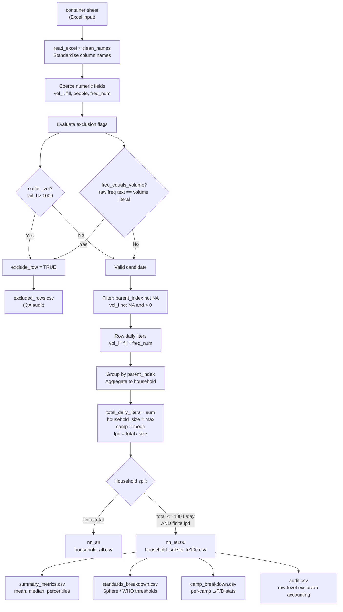

# Container L/P/D Analysis — Workflow Overview

**Script:** `container_lpd_analysis.R`
**Purpose:** Calculate household-level liters per person per day (L/P/D) from water container data collected in the Tawila WASH survey, applying data-quality filters to remove artifacts before aggregation.

---

## Workflow Diagram



---

## Inputs

| Item | Path |
|------|------|
| Container data (Excel) | `data/20260210_wash_survey_hh_container_level_PROCESSED.xlsx` |
| Sheet | `container` |

Key columns used from the input:

- `volume_liters` — container capacity (character, coerced to numeric)
- `fill_level` — current fill proportion (numeric: 1.0, 0.75, 0.5, 0.25)
- `frequency_filled_num` — how many times per day the container is filled (numeric)
- `frequency_filled` — raw text of fill frequency (used for artifact detection)
- `total_no_of_people_in_hh` — household size
- `parent_index` — links container rows to their household
- `camp_name` — one of Camp A / B / C / D

---

## Processing Steps

### Step 1 — Read and standardise column names

The container sheet is read with `read_excel()` and column names are standardised to snake_case with `janitor::clean_names()`.

### Step 2 — Coerce numeric fields and detect exclusion flags

Four numeric fields are coerced from character using `as.numeric()`:

- `vol_l` from `volume_liters`
- `fill` from `fill_level` (clamped to [0, 1]; defaults to 1 if missing)
- `people` from `total_no_of_people_in_hh`
- `freq_num` from `frequency_filled_num` (defaults to 1 if missing)

Two exclusion rules are evaluated per row:

| Rule | Flag | Condition |
|------|------|-----------|
| Outlier volume | `outlier_vol` | `volume_liters > 1000 L` |
| Artifact frequency | `freq_equals_volume` | Raw `frequency_filled` text is a pure number that equals `volume_liters` in the same row |

The second rule catches a known data-entry artifact where the volume value was mistakenly entered in the frequency field (e.g., volume = 20, frequency = "20").
Arabic-Indic digits in the raw frequency text are normalised to ASCII before comparison.

### Step 3 — Filter to valid rows

Rows are kept only if:

- Not flagged by either exclusion rule
- `parent_index` is not missing
- `vol_l` is not missing and > 0

### Step 4 — Calculate row-level daily liters

For each valid container row:

```
daily_liters_record = volume_liters * fill_level * frequency_filled_num
```

### Step 5 — Aggregate to household level

Rows are grouped by `parent_index`. For each household:

| Field | Calculation |
|-------|-------------|
| `total_daily_liters` | `sum(daily_liters_record)` across all containers |
| `household_size` | `max(total_no_of_people_in_hh)` across containers (same value repeated) |
| `camp` | Most common non-empty `camp_name` value |
| `lpd` | `total_daily_liters / household_size` |

### Step 6 — Split into two analysis datasets

| Dataset | Filter | Use |
|---------|--------|-----|
| `hh_all` | Finite `total_daily_liters` | Full picture including outlier households |
| `hh_le100` | `total_daily_liters <= 100` AND finite `lpd` | Primary reporting subset; removes households with implausibly high daily totals |

---

## Results Tables

### Summary metrics (`_summary_metrics.csv`)

Descriptive statistics for the `hh_le100` subset:

- Total households (all / <=100 / >100)
- Mean, median, standard deviation
- Min, max
- Percentiles: P10, P25, P50, P75, P90, P95

### Humanitarian standards breakdown (`_standards_breakdown.csv`)

Distribution of `hh_le100` households across Sphere/WHO thresholds:

| Level | Threshold |
|-------|-----------|
| Below Emergency Minimum | < 7.5 L/P/D |
| Emergency Range | 7.5 – 15 L/P/D |
| Sphere Standard | 15 – 20 L/P/D |
| Above WHO Minimum | >= 20 L/P/D |

### Camp breakdown (`_camp_breakdown.csv`)

Per-camp summary for `hh_le100`: household count, mean L/P/D, median L/P/D, standard deviation.
All four camps (A–D) always appear, with zeros for camps with no qualifying households.

### Audit table (`_audit.csv`)

Row-level accounting of the filtering process:

- Total container rows in input
- Rows excluded by each rule individually and combined
- Rows used in analysis
- Household counts and mean/median L/P/D for the <=100 subset

### Excluded rows detail (`_excluded_rows.csv`)

One row per excluded container, recording:

- `index`, `parent_index`, `camp_name`
- Raw `volume_liters`, `frequency_filled`, `frequency_filled_num`
- Boolean flags `outlier_vol`, `freq_equals_volume`
- `exclusion_reason` label (for QA review)

---

## Outputs

All files are written to the `output/` directory with the prefix `container_lpd_artifact_filtered_`:

| File | Contents |
|------|----------|
| `_household_all.csv` | All households with finite daily totals |
| `_household_subset_le100.csv` | Households with total <= 100 L/day |
| `_summary_metrics.csv` | Descriptive statistics |
| `_standards_breakdown.csv` | Sphere/WHO threshold distribution |
| `_camp_breakdown.csv` | Per-camp L/P/D summary |
| `_audit.csv` | Exclusion accounting |
| `_excluded_rows.csv` | Detail of excluded container rows |

---

## Key Design Decisions

**Why the <= 100 L/day subset?**
Households reporting very high total daily water volumes (>100 L/day) are likely affected by data quality issues (mis-entered frequencies or volumes not caught by the artifact filter). The subset provides a conservative, credible basis for humanitarian reporting.

**Why `max()` for household size?**
The household size field is repeated identically across all container rows for the same household. Using `max()` is a safe aggregation that returns the correct value regardless of any minor inconsistencies.

**Why `first_mode()` for camp?**
Same logic — camp name is repeated across container rows. Mode is used defensively in case of inconsistencies.
